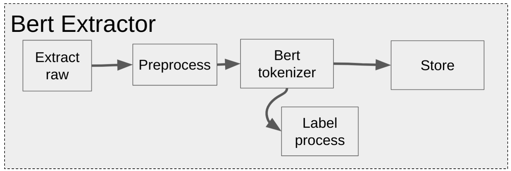

# BERT Data Extractor
Python module to extract and preprocess data for BERT classification.

In this package, there are two types of extractors, one for Text Classification and another one for Token Classification, each of them extracts an associated dataset. It can also be extended to use with other NLP problems.

The difference between one outcoming tensor and the other one are the labels, in Text Classification (Amazon Reviews) there is one label for the tokenized sentences, and in the Token Classification (CoNLL 2003) there is a label for each token.

BERT requires specific format as input. A BERT model needs tokenized words, the tokenization depends on which BERT model is selected.
All BERTs models are defined [here](https://huggingface.co/transformers/pretrained_models.html). All of these BERTs models can be used in the package setting in the configuration file.

# Installation
## Installation with Poetry (Recommended)

This package was developed with [Poetry](https://python-poetry.org/docs/) as an environment isolation and dependencies solving tool.

To install Poetry download the source and run it:

install and add it to the shell:
```
$ curl -sSL https://raw.githubusercontent.com/python-poetry/poetry/master/get-poetry.py | python -
$ source $HOME/.poetry/env
```

to uninstall Poetry:
```
$ python get-poetry.py --uninstall
$ POETRY_UNINSTALL=1 python get-poetry.py
```

#### Install package

To install the package run:
```
$ poetry install
```

## Installation with pip
Also provided another way to install this package:
```
$ pip install -r requirements.txt
```

## Project structure
```
bert_extractor
├── bert_extractor:
│   ├── main: script that run the project, with CLI.
│   ├── configs: read and validate configurations.
│   ├── utils: utilities file to use in the package.
│   ├── constants: constants values.
│   └── extractors: bert_extractor python package.
│       ├── base: base class to BERT extractors.
│       ├── ner: NER sub class that extract and preprocess the data for Token Classification.
│       └── reviews: sub class extract and preprocess Amazon reviews for Text Classification.
│
├── config: folder with sample configuration files samples.
├── data: folder with extracted raw data samples.
└── tests: tests for all the package.
    └── extractor:
        ├── test_base_extractor: tests for base class.
        ├── test_ner_extractor: tests for ner class.
        ├── test_reviews_extractor: tests for reviews class.
        └── sample_data: examples of data to test.
```

## Running
For running purpose, a [main.py](./bert_extractor/main.py) file was created that instantiate the extractors and execute them depending on the configuration set. It is also executable with CLI using [Click](https://click.palletsprojects.com/en/8.0.x/) package.

### Running Procedure
Example command to run this package:
```
$ poetry run main.py --config_path=../config/config_sample_reviews.json --output_path=../data/
```

### Quickstart
It is provided a [quickstart](quickstart.ipynb) notebook to see the package in action and training a BERT model with the extracted and processed tensor.

## Extractors

There is a base class for extraction and each subclass inherits it for specific extractors.



This problem is a data pipeline, so for that reason methods were created for each step:

- Extraction raw data.
- Preprocess raw data.
- BERT tokenization
    - Labels tokenization (if needed).
- Save tokenized output.

### Types of datasets
#### NER Dataset
The NER dataset is a CoNLL 2003 problem (Token classification). It is from Kaggle, so Kaggle's API was needed to download the dataset.
In order to pass the credentials at runtime the [repo](https://github.com/fawolfmann/kaggle-api) was forked so it did not authenticate when the package was imported.

So as to use it, the [credentials](https://www.kaggle.com/docs/api#authentication) have to be set in the configuration file. In addition, a cached dataset on [data](./data) folder is kept.

#### Amazon Reviews Dataset
The reviews dataset is public but access is required in a google form. In the web page, there is a light dataset to use in development time; also there is cached one dataset to try.

This is a Text classification problem.

Note: even is not a good practices commit data into github, in this time has been add an example of cached data in case there is no Kaggle API tokens.

# CI
This repo has a [Github action](.github/workflows/ci.yml) that executes the tests in the [tests](./tests) folder on each commit in a PR o merging process, they run with [nox](https://nox.thea.codes/en/stable/). Nox creates a virtual environment, install the package and run all the tests.

## Testing
For testing purposes, pytest is used. Pytest sits on top of unittest and adds some capabilities like fixtures and an easier test creation process.

## Linting
For this module it was used tools to lint code with coding good practice.
- black : code formatter.
- isort : sort imports.
- pylint : static code analysis tool.
- pre-commit : to run all the linting process before commit.

### GitFlow
For each new feature,  a new branch in the project, and a pull request were created. When the PR was finished it was merged.
This helped to work in different parts of the project at the same time.

## Production
For production, It is suggested to use data pipeline tools such as Airflow, Prefect, Dagster or any other. These tools help to maintain the data pipeline, knowing when a process fails, adding retrying tools, using sensor, resource allocation, and many more.

### Pin versions
When going to production, it is desirable to pin the exact version of your package dependencies because any update of a dependency that can break your package.

### Poetry to production
The best way to go in production is on an isolated environment, managed with docker or any other virtual environment tool.

#### To Docker

It is provided a [Dockerfile](Dockerfile) in this repository as an example on how it would run this on production.

#### To pip
Also if the requirements are others,  this package can be export to install it with pip.

this command creates a `requirements.txt`:
```
$ poetry export -f requirements.txt --output requirements.txt
```
after that install it with:
```
$ pip install -r requirements.txt
```

### Next Steps

- Extend for more datasets.
- Extend to others NLP problems, like Question Answering.
- Generalize for other NLP models, like Fasttext or Gensim.
- Implement with Airflow.
- Implement Spark version to scale up if the volume of data requires.